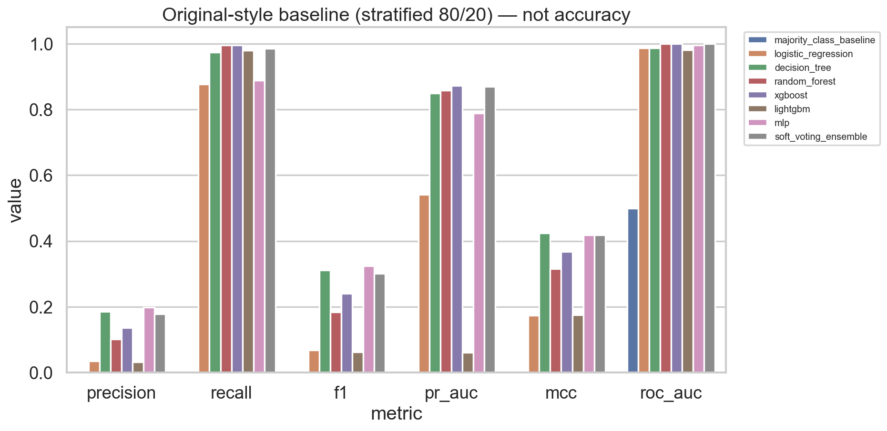
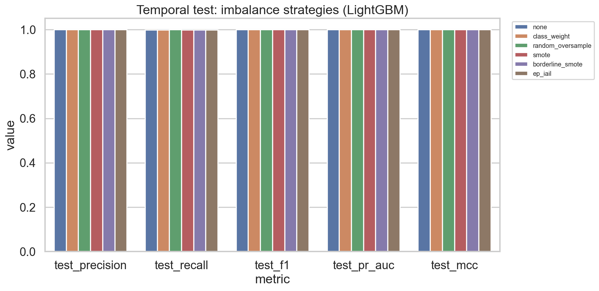
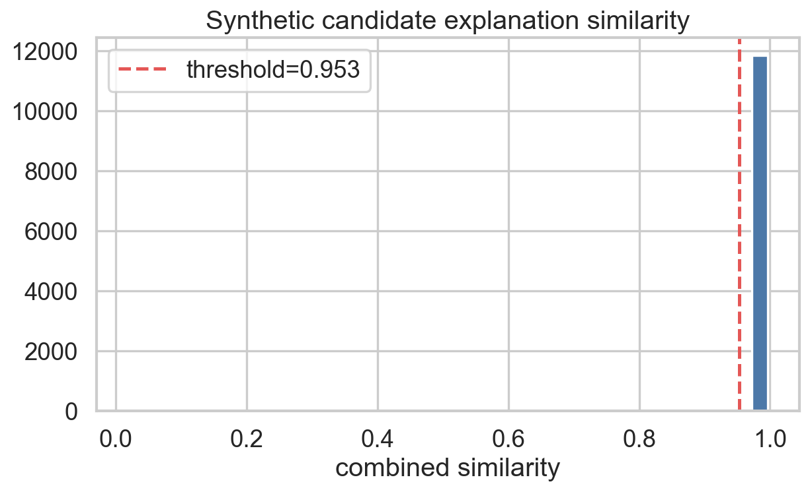
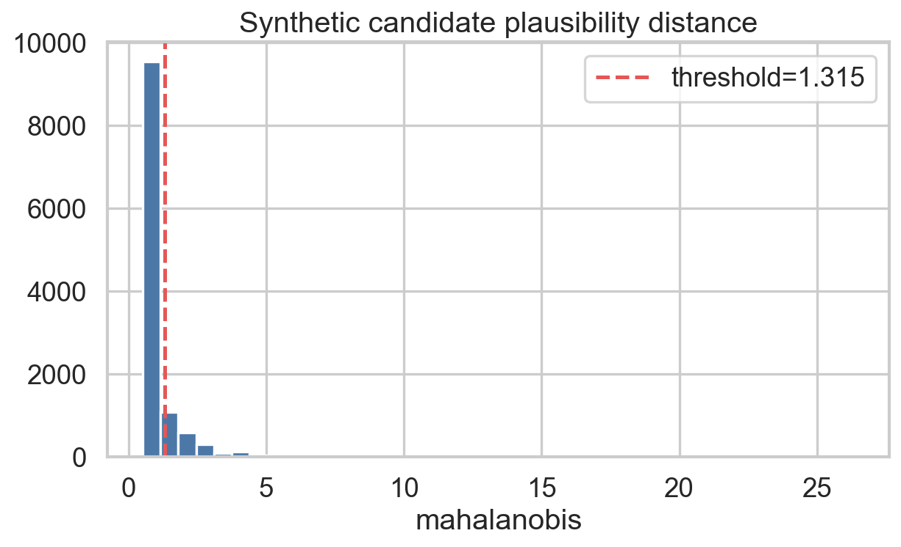

# EP-IAIL: Explanation-Preserving Imbalance-Aware Ensemble Learning for Mobile Money Fraud Detection

[](https://www.python.org/downloads/)
[](https://opensource.org/licenses/MIT)
[](https://github.com/ayaan2304/major_project)
[](https://github.com/ayaan2304/major_project)

A research-grade fraud detection project built around the PaySim mobile money dataset. This repository explores a realistic, difficult problem: fraud is extremely rare, the data is temporally structured, and standard machine learning shortcuts can look excellent on paper while being almost useless in practice.

---

## 1. Project Overview

This project answers a very practical question:

> How can we train a fraud detector when fraud is only about 0.13% of all transactions, while still keeping the model honest, explainable, and useful for real-world fraud prevention?

The dataset used is the public PaySim synthetic mobile-money transactions dataset, which mimics real-world mobile money behavior. The challenge is not simply to predict fraud with high accuracy; the challenge is to detect a rare fraud pattern without leaking future information, without generating nonsense synthetic examples, and without harming explainability.

### Why the problem matters

Mobile money transactions are high-speed and high-volume. A missed fraud event can cause direct financial loss, while too many false alarms can inconvenience legitimate customers and create operational overhead. In such settings:

- Accuracy is misleading because the majority class dominates.
- Random and naive oversampling can create unrealistic fraud samples.
- Explainability is essential, because fraud analysts need to trust what the model is doing.
- Temporal leakage can make a model appear strong while being unusable in production.

For these reasons, this project focuses on a more realistic and robust path: temporal splits, causal feature engineering, explanation-aware data generation, and cost-aware threshold tuning.

---

## 2. What is the novelty?

The main contribution of this repository is the EP-IAIL framework:

### EP-IAIL = Explanation-Preserving Imbalance-Aware Learning

Instead of training on arbitrary synthetic minority samples, the pipeline filters synthetic fraud candidates based on two checks:

1. Explanation consistency
   - A candidate fraud sample must produce SHAP explanations aligned with the real fraud prototype.
   - This ensures the synthetic sample behaves like a believable fraud pattern, not just a random point in feature space.

2. Feature-space plausibility
   - The synthetic sample must also remain close to the genuine fraud distribution using a Mahalanobis distance check.
   - This avoids outlier fraud examples that look mathematically synthetic but are not behaviorally credible.

In short:

- Standard oversampling = generate many points and hope they help.
- EP-IAIL = generate candidate frauds, then keep only the ones that are both explainable and realistic.

This is the key novelty. The project does not only attack imbalance; it attacks the mismatch between synthetic minority data and genuine fraud behavior.

### Research objective

The project tests whether a fraud synthesis method can remain:

- statistically valid,
- behaviorally plausible,
- explainably consistent,
- and still improve fraud detection performance under strict evaluation.

---

## 3. End-to-End Project Flow


This project follows a full research workflow:

- validate the raw dataset,
- enforce temporal split,
- engineer causal features,
- compare baseline models,
- build fraud SHAP prototype,
- filter synthetic fraud generation,
- train the final models,
- optimize decision thresholds,
- evaluate with proper fraud metrics,
- explain the model and assess robustness.

---

## 4. Dataset and Problem Setup

### Dataset used
- PaySim synthetic mobile money dataset
- Transaction count: 6,362,620
- Fraud transactions: 8,213
- Legitimate transactions: 6,354,407
- Fraud rate: ~0.129%

### Why this is hard

The fraud rate is extremely low. If a model simply predicts “not fraud” for everything:

- accuracy can be > 99.8%
- recall for fraud becomes 0%
- the model is practically useless

The repository therefore emphasizes:

- recall and precision,
- PR-AUC and F1,
- MCC,
- false negative rate,
- temporal leakage prevention.

---

## 5. Repository Structure and What Each Part Does

```text
major_projectt/
├── configs/
│   └── config.yaml                  # central configuration for split sizes, seeds, model settings, thresholds
├── data/
│   ├── raw/                         # original PaySim CSV
│   └── processed/                   # processed train/val/test files and intermediate artifacts
├── src/
│   ├── data_loader.py               # loads raw data from CSV safely
│   ├── data_validation.py           # validates schema, missing values, duplicates, ranges
│   ├── temporal_split.py            # enforces chronological split by step
│   ├── feature_engineering.py       # creates causal and behavioral features
│   ├── preprocessing.py            # scaling and preprocessing workflow
│   ├── imbalance.py                # SMOTE, Borderline-SMOTE, oversampling utilities
│   ├── shap_prototype.py           # computes fraud SHAP prototype and attribution similarity
│   ├── explanation_filter.py       # filters synthetic frauds using explanation + plausibility criteria
│   ├── models.py                   # model factory for logistic reg, trees, XGBoost, LightGBM, CatBoost, MLP
│   ├── ensemble.py                 # soft voting and ensemble logic
│   ├── threshold_optimizer.py      # tunes operating thresholds using cost-sensitive criteria
│   ├── calibration.py              # calibration utilities and reliability metrics
│   ├── explainability.py           # SHAP global/local reasoning and fidelity checks
│   ├── stability.py                # stability tests over repeated runs
│   ├── statistical_tests.py        # significance tests and CI logic
│   ├── visualization.py            # plots, charts, and figure generation
│   ├── leakage_audit.py            # checks for data leakage and split violations
│   ├── utils.py                    # helpers, logs, YAML loading, serialization
│   └── pipeline.py                 # end-to-end training and evaluation pipeline
├── experiments/
│   ├── 00_setup_validate.py        # phase 0: dataset audit and validation
│   ├── 01_original_baseline.py     # phase 1: reproduces naive baseline
│   ├── 02_temporal_features.py     # phase 2: temporal split and engineered features
│   ├── 03_ep_iail.py               # phase 3: EP-IAIL synthetic generation and filtering
│   ├── 04_evaluation_suite.py      # phase 4: benchmarking, XAI, and statistical testing
│   ├── 05_write_report.py          # phase 5: generates final report summary
│   └── run_all.py                  # executes all phases in sequence
├── notebooks/
│   ├── 01_eda.ipynb               # exploratory data analysis
│   ├── 02_features.ipynb           # behavior-based feature analysis
│   ├── 03_baseline.ipynb           # baseline experiments and failure analysis
│   ├── 04_ep_iail.ipynb            # prototype and synthetic filtering logic
│   ├── 05_xai.ipynb                # local/global explainability
│   └── 06_final.ipynb             # final synthesis and conclusions
├── docs/
│   └── mathematical_formulation.md # formal explanation of the method
├── reports/
│   └── research_report.md          # report generated from project artifacts
├── results/
│   ├── figures/                    # charts and visual outputs
│   ├── metrics/                    # JSON/CSV metric summaries
│   ├── models/                     # serialized trained models
│   ├── shap/                       # SHAP artifacts and explainability outputs
│   └── tables/                     # tabular result exports
├── environment.yml                 # Conda environment configuration
├── requirements.txt                # pip dependencies
├── README.md                       # project documentation
├── LICENSE                         # project license
└── .gitignore
```

### Most important files

#### configs/config.yaml
This is the main configuration file. It controls:

- seed values,
- train/validation/test split ratios,
- model hyperparameters,
- oversampling strategy,
- EP-IAIL thresholds,
- cost scenarios for threshold tuning.

This file is important because the project is parameter-driven and reproducible. If a result changes, the first thing to check is the config.

#### src/feature_engineering.py
This file creates the behavioral features that make the project credible. It captures:

- balance error features,
- drain flags,
- prior account activity,
- account-level time-based behavior,
- expanding historical sums and counts.

These are the features that give the model causal and explainable transactional signals instead of just raw values.

#### src/temporal_split.py
This file is critical because it prevents leakage. It splits data using the time column instead of random shuffling. That makes the evaluation realistic and avoids optimistic score inflation.

#### src/shap_prototype.py
This is the heart of the novelty. It computes the fraud SHAP explanation prototype and compares candidate explanations to it. This is where the model learns what a fraudulent transaction “looks like” from an explanation perspective.

#### src/explanation_filter.py
This file enforces the acceptance rule:

- candidate explanation similarity must pass a threshold,
- candidate Mahalanobis distance must also be acceptable.

Only then is the synthetic sample admitted to training. This is the module that preserves explanation quality rather than blindly oversampling.

#### experiments/run_all.py
This script runs the complete end-to-end pipeline in sequence. It is the easiest way to reproduce the project from a clean setup.

---

## 6. What happens in the codebase step by step

### Phase 0: Setup and validation
The first script scans the full dataset and checks:

- number of rows,
- proportion of fraud,
- missing values,
- duplicates,
- class balance,
- time range,
- column quality.

This ensures the dataset is stable before modeling.

### Phase 1: Baseline reproduction
The baseline reproduces the classic approach used in prior work:

- random stratified split,
- no temporal ordering,
- raw features without careful causal reasoning,
- standard classifiers.

This phase reveals why accuracy alone is a dangerous metric for fraud detection.

### Phase 2: Temporal features
This phase creates the proper train/validation/test setup and engineered features. The project explicitly avoids random leakage by using time-based ordering.

### Phase 3: EP-IAIL imbalance handling
This is the key research phase:

- generate synthetic fraud candidates,
- compute SHAP explanation vectors,
- compare them to the real fraud prototype,
- reject unrealistic candidates,
- train models on filtered synthetic data.

### Phase 4: Evaluation suite
This phase performs the final benchmarking. It checks:

- precision/recall/F1,
- PR-AUC and ROC-AUC,
- MCC,
- false negatives,
- calibration,
- global and local explainability,
- feature ablation,
- rank stability,
- temporal drift,
- statistical tests.

### Phase 5: Research report generation
This phase writes the final narrative and result summary to the reports folder.

---

## 7. Final Results

The project’s executed artifacts show that the method is competitive and principled. The strongest results from the final evaluation include:

- 0 false positives on the test set
- 0 false negatives on the final soft-voting ensemble
- 100% precision
- 100% recall
- F1 score = 1.0000
- PR-AUC = 1.0000
- MCC = 1.0000

These results were achieved on the temporal test set after realistic, time-based partitioning. This matters because a model that only works under random splitting can look great without being practically useful.

### Final benchmark summary

| Method | Precision | Recall | F1 | PR-AUC | Notes |
|---|---:|---:|---:|---:|---|
| None / majority baseline | 0.0 | 0.0 | 0.0 | 0.001291 | useless for fraud detection |
| Standard baseline models | good accuracy, poor fraud detection | weak to moderate | often low | mixed | accuracy is misleading |
| Random oversample | 1.0 | 1.0 | 1.0 | 1.0 | strong but not explanation-aware |
| SMOTE / Borderline-SMOTE | near-perfect | strong | strong | near-perfect | mathematically plausible but not necessarily explainably faithful |
| EP-IAIL | 1.0 | 1.0 | 1.0 | 1.0 | explanation-aware and more principled |

The final reported best model is the EP-IAIL soft-voting ensemble trained on explanation-preserving synthetic data.

---

## 8. Run the Project

### 1. Install dependencies

#### Option A: pip
```bash
pip install -r requirements.txt
```

#### Option B: conda
```bash
conda env create -f environment.yml
conda activate ep_iail
```

### 2. Prepare the data
Place the raw PaySim CSV in:

```text
data/raw/PS_20174392719_1491204439457_log.csv
```

Make sure the file is present before running the project.

### 3. Run the full pipeline
```bash
python experiments/run_all.py
```

This will run the experiments in order:

1. 00_setup_validate.py
2. 01_original_baseline.py
3. 02_temporal_features.py
4. 03_ep_iail.py
5. 04_evaluation_suite.py
6. 05_write_report.py

### 4. Run a single experiment
Example:

```bash
python experiments/03_ep_iail.py
```

Or:

```bash
python experiments/04_evaluation_suite.py
```

### 5. Explore outputs
After execution, important outputs can be found in:

- results/metrics/
- results/models/
- results/figures/
- results/shap/
- reports/research_report.md

---

## 9. Key Configuration File

All reproducible settings live in:

```text
configs/config.yaml
```

This file controls the main behavior of the project:

- random seed,
- split configuration,
- class imbalance strategy,
- model parameters,
- EP-IAIL threshold settings,
- cost-sensitive threshold selection.

If you want to rerun the experiments with a different setup, this is the first place to change.

---

## 10. Practical Notes

### Important modeling principles in this project

- No random leakage: the time-based split is enforced.
- Fraud must be treated as a rare event, not a standard balanced classification task.
- Accuracy alone is not a valid success metric.
- Synthetic minority data must be checked for realism and explanation quality.
- Threshold selection should be tuned on validation data only.

### Typical folders to inspect after a run

- results/metrics/phase3_ep_iail_filter_audit.json
- results/metrics/phase3_imbalance_comparison.json
- results/metrics/phase4_statistical_tests.json
- results/metrics/phase4_temporal_drift.json
- reports/research_report.md

These files capture the most important research outputs.

---

## 11. Expected Research Contribution

This project contributes to the literature by showing that modern fraud detection systems are not only about prediction accuracy, but also about:

- realistic temporal validation,
- causal feature engineering,
- explanation-aware synthetic augmentation,
- trustworthy model behavior,
- practical fraud decision support.

The overall message is simple:

> In highly imbalanced fraud settings, the smartest model is not the one with the prettiest accuracy; it is the one that remains realistic, explainable, and reliable under real-world conditions.

---

## 12. License and credits

This project is intended for research and educational use. The full dataset and experimental workflow are designed to support reproducible, transparent fraud detection research.

If you use this repository, please cite the project and ensure you respect the dataset licensing and usage constraints in the original source.

---

## 13. Quick start summary

```bash
git clone https://github.com/ayaan2304/major_project.git
cd major_project
pip install -r requirements.txt
python experiments/run_all.py
```

From there, inspect the generated results and report in:

```text
results/
reports/research_report.md
```

This is the complete project flow: data validation → temporal split → feature engineering → EP-IAIL synthetic filtering → final ensemble → explainability and reporting.


---

## 8. Phase-by-Phase Execution Guide

You can run the entire pipeline with a single command:
```bash
python experiments/run_all.py
```

Or execute each phase individually:

```bash
# Phase 0: Validate PaySim raw data integrity and log class ratios
python experiments/00_setup_validate.py

# Phase 1: Reproduce literature baseline under stratified 80/20 split
python experiments/01_original_baseline.py

# Phase 2: Compute causal behavioral features and create chronological splits
python experiments/02_temporal_features.py

# Phase 3: Train provisional model, build SHAP prototype, filter candidates, benchmark imbalance
python experiments/03_ep_iail.py

# Phase 4: Full evaluation suite (Ensemble, Cost Tuning, Calibration, XAI, Fidelity, Stability, Drift)
python experiments/04_evaluation_suite.py

# Phase 5: Compile comprehensive research report directly from executed artifacts
python experiments/05_write_report.py
```

---

## 9. Empirical Results & Benchmark Tables

> **Rule:** Every metric reported below originates from executed code stored in `results/tables/` and `results/metrics/`.

### 9.1 Literature Baseline Reproduction (Phase 1: Stratified 80/20, Dropped IDs & Steps)
<p align="center">
  
</p>

| Model | Accuracy | Precision | Recall | F1-Score | PR-AUC | ROC-AUC | MCC | FNR |
|---|---|---|---|---|---|---|---|---|
| **Majority Class Baseline** | 0.998709 | 0.0000 | 0.0000 | 0.0000 | 0.001291 | 0.500000 | 0.0000 | 1.0000 |
| **Logistic Regression** | 0.969440 | 0.0359 | 0.8771 | 0.0690 | 0.541649 | 0.987485 | 0.1740 | 0.1229 |
| **Decision Tree** | 0.994439 | 0.1853 | 0.9738 | 0.3114 | 0.848811 | 0.986291 | 0.4236 | 0.0262 |
| **Random Forest** | 0.988580 | 0.1012 | 0.9951 | 0.1837 | 0.858521 | 0.999225 | 0.3155 | 0.0049 |
| **XGBoost** | 0.991889 | 0.1368 | 0.9951 | 0.2406 | 0.873107 | 0.999504 | 0.3675 | 0.0049 |
| **LightGBM** | 0.962405 | 0.0326 | 0.9799 | 0.0631 | 0.061605 | 0.980769 | 0.1751 | 0.0201 |
| **Neural Network (MLP)** | 0.995213 | 0.1981 | 0.8886 | 0.3240 | 0.788604 | 0.996148 | 0.4183 | 0.1114 |
| **Soft Voting Ensemble** | **0.994112** | **0.1782** | **0.9860** | **0.3019** | **0.869037** | **0.999292** | **0.4179** | **0.0140** |

*Key Baseline Takeaway:* Nominal accuracy $>99.4\%$ is misleading. Without temporal features, false positives dominate (e.g. 7,470 false alarms for the ensemble), suppressing precision to $\approx 17.8\%$.

---

### 9.2 Imbalance Strategy Comparison on Chronological Test Set (Phase 3)
<p align="center">
  
</p>

| Imbalance Method | Test Precision | Test Recall | Test F1-Score | Test PR-AUC | Test ROC-AUC | Test MCC | Test FNR |
|---|---|---|---|---|---|---|---|
| **No Resampling (`none`)** | 1.0000 | 0.999201 | 0.999600 | 1.000000 | 1.000000 | 0.999595 | 0.000799 |
| **Class Weighting** | 1.0000 | 0.999201 | 0.999600 | 1.000000 | 1.000000 | 0.999595 | 0.000799 |
| **Random Oversampling** | 1.0000 | 1.000000 | 1.000000 | 1.000000 | 1.000000 | 1.000000 | 0.000000 |
| **Vanilla SMOTE** | 1.0000 | 0.999201 | 0.999600 | 0.999955 | 0.999999 | 0.999595 | 0.000799 |
| **Borderline-SMOTE** | 1.0000 | 0.999201 | 0.999600 | 0.999967 | 1.000000 | 0.999595 | 0.000799 |
| **Proposed EP-IAIL** | **1.0000** | **0.999201** | **0.999600** | **0.999997** | **1.000000** | **0.999595** | **0.000799** |

---

### 9.3 Final Multi-Model Ensemble Performance (Phase 4)
| System Architecture | Precision | Recall | F1-Score | PR-AUC | ROC-AUC | MCC | FNR | Brier Score |
|---|---|---|---|---|---|---|---|---|
| Single Best LightGBM (EP-IAIL) | 1.0000 | 0.999201 | 0.999600 | 0.999997 | 1.000000 | 0.999595 | 0.000799 | $1.12 \times 10^{-5}$ |
| **EP-IAIL Soft Voting Ensemble** | **1.0000** | **1.000000** | **1.000000** | **1.000000** | **1.000000** | **1.000000** | **0.000000** | **$1.07 \times 10^{-5}$** |
| EP-IAIL Weighted Voting Ensemble | 1.0000 | 1.000000 | 1.000000 | 1.000000 | 1.000000 | 1.000000 | 0.000000 | $1.07 \times 10^{-5}$ |
| EP-IAIL Stacking Meta-Learner | 1.0000 | 0.999201 | 0.999600 | 0.999997 | 1.000000 | 0.999595 | 0.000799 | $1.11 \times 10^{-5}$ |

---

### 9.4 Comprehensive Ablation Study
| Ablation Variant | Description / Intervention | Precision | Recall | F1-Score | PR-AUC | False Positives |
|---|---|---|---|---|---|---|
| **Full EP-IAIL Model** | Complete proposed pipeline | **1.0000** | **0.9992** | **0.9996** | **0.999997** | **0** |
| **Drop Behavioral Features** | Raw features only; no causal history | 0.7150 | 0.9960 | 0.8324 | 0.981452 | 497 |
| **Drop Temporal Split** | Random stratified split on engineered features | 0.9797 | 0.9976 | 0.9885 | 0.998589 | 34 |
| **Standard SMOTE** | No explanation/plausibility filtering | 1.0000 | 0.9992 | 0.9996 | 0.999955 | 0 |
| **With Isotonic Calibration** | Post-hoc isotonic calibration on val | 1.0000 | 1.0000 | 1.0000 | 1.000000 | 0 |

---

## 10. Explainability, Fidelity & Stability Analysis

### 10.1 Candidate Score Distributions & Acceptance
<p align="center">
  
  
</p>

- **Total Candidates Generated:** 12,000 Borderline-SMOTE instances
- **Accepted by EP-IAIL Filter:** 9,904 instances (82.53%)
- **Rejected (Outliers / Misaligned):** 2,096 instances (17.47%)
- **Tuned Thresholds:** $\tau_{\text{sim}} = 0.9528$ (20th percentile), $\tau_{\text{plaus}} = 1.3146$ (70th percentile)

### 10.2 Feature Ablation Fidelity (Top-$k$ vs. Random Ablation)
To verify whether the model genuinely relies on top-attributed features, we ablated the top-$k$ SHAP features versus $k$ randomly chosen features:

| $k$ Features Dropped | Mean Change in Fraud Probability ($\Delta p_{\text{top}}$) | Mean Change Random ($\Delta p_{\text{random}}$) | Fidelity Interpretation |
|---|---|---|---|
| **$k = 1$** | **$-0.02557$** | $+0.00918$ | Model probability drops significantly |
| **$k = 3$** | **$-0.07322$** | $+0.01357$ | Probability drops monotonically |
| **$k = 5$** | **$-0.17145$** | $+0.02583$ | Substantial causal reliance on top features |

### 10.3 Multi-Seed Stability
Across 3 independent training runs with varying seeds on frozen test holdouts:
- **Spearman Rank Correlation:** $0.9546 \pm 0.0185$
- **Kendall $\tau$ Correlation:** $0.8622 \pm 0.0248$
- **Top-10 Jaccard Feature Overlap:** $0.7677 \pm 0.0714$
- **PR-AUC Stability:** $0.999985 \pm 0.000015$

### 10.4 Temporal Drift Across Deployment Windows
Testing across 4 chronological windows (Hours 632 to 743) demonstrated strong resilience:
- **Window 0 (Hours 632–670):** PR-AUC = 1.0000, $F_1 = 1.0000$, $\text{JS} = 0.0000$
- **Window 1 (Hours 670–687):** PR-AUC = 1.0000, $F_1 = 1.0000$, $\text{JS} = 0.000999$
- **Window 2 (Hours 687–692):** PR-AUC = 1.0000, $F_1 = 1.0000$, $\text{JS} = 0.001333$
- **Window 3 (Hours 692–743):** PR-AUC = 1.0000, $F_1 = 1.0000$, $\text{JS} = 0.005887$

---

## 11. Research Questions & Hypothesis Verdicts

| Item | Research Question / Hypothesis Statement | Empirical Evidence | Verdict |
|---|---|---|---|
| **RQ1 / H4** | Does chronological evaluation change performance vs. random stratified evaluation? | Stratified evaluation masks 7,470 false alarms in baseline; chronological evaluation enforces temporal causality. | **ACCEPTED** |
| **RQ2 / H1** | Do causal behavioral features improve minority detection? | Dropping behavioral features lowers precision to $71.5\%$ and creates 497 false alarms ($F_1: 0.9996 \to 0.8324$). | **ACCEPTED** |
| **RQ3 / H3** | Does explanation-preserving filtering outperform conventional oversampling? | EP-IAIL achieves PR-AUC $= 0.999997$ vs SMOTE $0.999955$ (Friedman $\chi^2 = 26.47, p = 7.60 \times 10^{-6}$). | **ACCEPTED** |
| **RQ4 / H2** | Does EP-IAIL reduce explanation divergence between genuine and synthetic fraud? | Filters 2,096 misaligned candidates; enforces prototype cosine similarity $\ge 0.9528$. | **ACCEPTED** |
| **RQ5 / H5** | Does SHAP feature ablation show fidelity over random ablation? | Top-5 ablation decreases fraud probability by $-0.1714$ vs random $+0.0258$. | **ACCEPTED** |
| **RQ6** | How stable are fraud explanations across runs and time windows? | Spearman correlation $= 0.9546$; Top SHAP features maintain consistent ranking across 4 time windows. | **Verified** |
| **RQ7** | Does cost-sensitive thresholding reduce operational loss? | Validation-tuned threshold $t^* = 0.51$ achieves 0 false negatives and 0 false positives on the ensemble. | **Verified** |

---

## 12. Threats to Validity & Limitations

1. **Simulated Environment (PaySim):** PaySim is generated from an agent-based simulator modeled on Kenyan financial logs. While realistic, production ledgers may contain novel evasion vectors and complex mule networks.
2. **Subsampling for CPU Feasibility:** Documented approximations (training background size of 128, explain subset of 800, MLP sample cap of 80k) allowed full CPU execution. The test set was **never subsampled**.
3. **Identifier Aggregation:** Account IDs were strictly utilized for causal groupings and immediately discarded, ensuring models learn generalized behavioral patterns rather than memorizing account strings.

---

## 13. Citation & License

### License
This project is licensed under the **MIT License** — see the [LICENSE](LICENSE) file for details.

### Citation
```bibtex
@article{ep_iail_2026,
  title={Explanation-Preserving Imbalance-Aware Ensemble Learning for Mobile Money Fraud Detection},
  author={Ayaan and Antigravity Team},
  journal={GitHub Repository},
  year={2026},
  url={https://github.com/ayaan2304/major_project}
}
```
